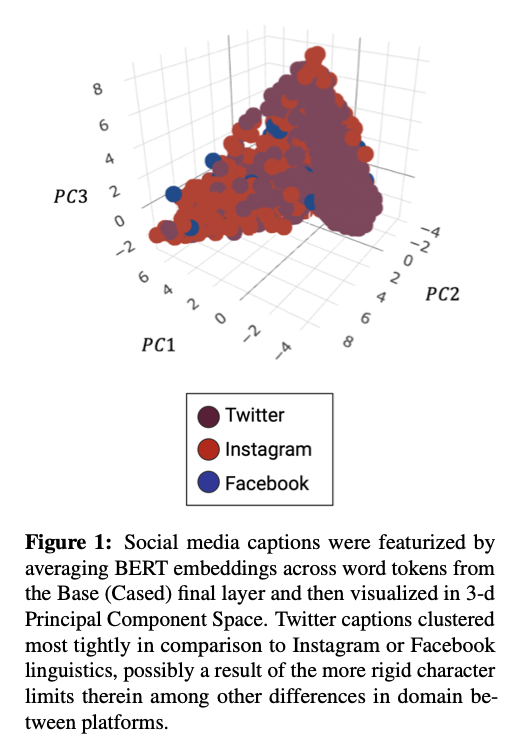
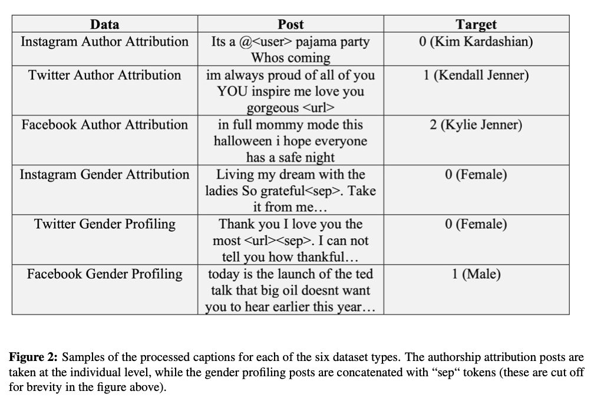

# NLP-experiments-social-media

## Abstract

Domain shift often hinders the predictive performance of machine learning models where it counts most, on unseen data. However, social media datasets in NLP are in general inflexible to domain shift as they are commonly sourced solely from Twitter, which fails to capture the variation of natural language that exists across different social media platforms. Here, we examined the potential of multi-platform mixing for domain adaptation by combining Instagram captions in equal proportion to Tweets for two authorship analysis tasks. The resulting SVM and LR classifiers saw significant boosts in performance when compared to otherwise identical models constructed entirely from Tweets (6% average F1 increase), as measured in cross-domain testing on Facebook captions.

Figure 1: Bert embeddings EDA | Figure 2: df.head
:---------------------------------:|:----------------------------------------:
 | 

